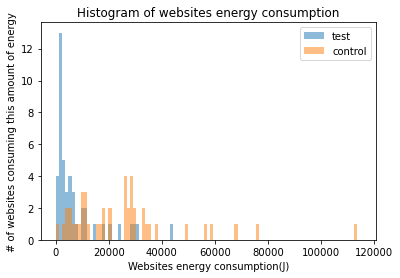
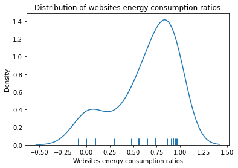

# Dynamically Adaptable Virtual Machines for Sustainable Websites

This notebook aim at providing the analysis process of the HTML VM enenergy consumption and gains

## Imports


```python
import json 
import glob
import pandas as pd
import numpy as np
import seaborn as sns
import matplotlib.pyplot as plt
from scipy.stats.mstats import gmean
from math import sqrt
import scipy.stats as stats
import scipy.special as special
```

## Website Carbon

This script aim to provide the energy consumption and carbon impact of website requests.

### Constants


```python
# Path to the folder containing HAR files
HAR_FOLDER = "./Data_Transfer/"

# Algorithm constants
KWG_PER_GB = 1.805
KWH_PER_BYTE = KWG_PER_GB / 1073741824
J_PER_KWH = 1000 * 3600
RETURNING_VISITOR_PERCENTAGE = 0.75
FIRST_TIME_VIEWING_PERCENTAGE = 0.25
PERCENTAGE_OF_DATA_LOADED_ON_SUBSEQUENT_LOAD = 0.02
CARBON_PER_KWG_GRID = 475
CARBON_PER_KWG_RENEWABLE = 33.4
PERCENTAGE_OF_ENERGY_IN_DATACENTER = 0.1008
PERCENTAGE_OF_ENERGY_IN_TRANSMISSION_AND_END_USER = 0.8992
CO2_GRAMS_TO_LITRES = 0.5562

# Data access constants
NORMAL = 0
ADAPTED = 1
```

### Functions

adjustDataTranfert : calculate the average transfert size considering caching capacity of web browser

energyConsumption : calculate the energy consumption from the tranfert size

getCo2Grid : calculate the equivalent CO2 when using a classic host

getCo2Renewable : calculate the equivalent CO2 when using a green host

co2ToLitres : convert CO2 mass to volume

getStatistics : aggregate previous statistics

cleanerThan : compare to other sites


```python
def adjustDataTransfer(val): 
    out =  val * RETURNING_VISITOR_PERCENTAGE 
    out += val * PERCENTAGE_OF_DATA_LOADED_ON_SUBSEQUENT_LOAD * FIRST_TIME_VIEWING_PERCENTAGE
    return out
```


```python
def energyConsumption(bytes): 
    return bytes * KWH_PER_BYTE;
```


```python
def getCo2Grid(energy):
    return energy * CARBON_PER_KWG_GRID;
```


```python
def getCo2Renewable(energy):
    out =  energy * PERCENTAGE_OF_ENERGY_IN_DATACENTER * CARBON_PER_KWG_RENEWABLE
    out += energy * PERCENTAGE_OF_ENERGY_IN_TRANSMISSION_AND_END_USER * CARBON_PER_KWG_GRID
    return out
```


```python
def co2ToLitres(co2):
    return co2 * CO2_GRAMS_TO_LITRES;
```


```python
def getStatistics(bytes):
    bytesAdjusted = adjustDataTransfer(bytes);
    energy = energyConsumption(bytesAdjusted);
    co2Grid = getCo2Grid(energy);
    co2Renewable = getCo2Renewable(energy);

    return {
        'adjustedBytes' : bytesAdjusted,
        'energy' : energy,
        'co2' : {
            'grid' : {
                'grams' : co2Grid,
                'litres': co2ToLitres(co2Grid)
            },
            'renewable' : {
                'grams' : co2Renewable,
                'litres' : co2ToLitres(co2Renewable)
            }
        }
    }
```


```python
def cleanerThan(co2):
    # This array needs to be updated periodically with new data. This was
    # originally calculated with a database query but that was too slow at
    # scale. We can look in to writing a cron job that will generate and export
    # from the database once a month, that is then loaded in this file.

    # This array was last generated with rankings/index.php on 27/01/2020
    percentiles = [0.00126957622871866,0.004035396817140881,0.012595561048805604,0.023304715095553624,0.036438786824583,0.050362397616329,0.064014899640461,0.077739052678226,0.092126836186624,0.10757047217165,0.125027739890344,0.140696302455872,0.15929047315768,0.177734818869488,0.19581439489964,0.21422507361825607,0.232736823359142,0.246082174332492,0.264348156430992,0.28306902111392,0.30180466482882,0.320295382181204,0.33950686554985604,0.360111566931774,0.38114308483189,0.40185357017186396,0.42035354145420606,0.4393550630164101,0.458541453493762,0.47918906703882,0.499654077413412,0.521285635156174,0.5405494875603221,0.56161428648152,0.58238456980151,0.604316363860106,0.6256429617179278,0.6478269528228661,0.6691073942929641,0.68867154881184,0.7103787320465419,0.7331362414675519,0.7562483364936439,0.780892842691506,0.80396830015467,0.8269877794821401,0.85060546199698,0.874387816802448,0.899691291111552,0.92324242726303,0.9511826145960923,0.976586133398462,1.002258239346,1.02822903453074,1.0566669431626,1.08448123862022,1.1130571798008,1.1446436812039398,1.17548103245766,1.2075157831423,1.2419762271574795,1.27780212823068,1.31343697309996,1.3535322129548801,1.3963404885134,1.43538821676594,1.4786819721653202,1.52287253339568,1.5710404823845998,1.6176354301871,1.6627899659050596,1.71503331661196,1.7731704594157403,1.8271314036959998,1.8888232850004,1.9514501162933802,2.01843049142384,2.08929918752446,2.1680425684300615,2.2538809089543,2.347435716407921,2.44446281762258,2.551568006854039,2.6716183180923796,2.8030676779506,2.947526052684458,3.1029734241542397,3.2801577012624605,3.4659335564053406,3.6858566410374,3.9539822299055203,4.2833358140900835,4.686514950833381,5.167897618200399,5.7413021838327,6.52500051792535,7.628926245040858,9.114465674521588,12.30185529895519,92.584834950345]

    for i in range(0, 100):
        value = percentiles[i]
        if(co2 < value):
            return (100 - i)
    return 0
```


```python
def printInfo(bytesNb):
  stats = getStatistics(bytesNb)
  energy = stats["energy"]
  grams = stats["co2"]["grid"]["grams"]
  greenerThan = cleanerThan(grams)
  if(greenerThan > 50):
      print("\033[1;32;48mThis page is cleaner than " + str(greenerThan) + "% of web pages tested\033[00m")
  else:
      print("\033[1;31;48mThis page is dirtier than " + str(99-greenerThan) + "% of web pages tested\033[00m")
  print("\033[01m"+str(round(grams,3)) + "g of CO2\033[00m is produced every time someone visits this web page ("+str(round(energy,4))+" KWH)")
```

### Data

Build the datastructure from the HAR files


```python
HAR_FILES = glob.glob(HAR_FOLDER+"*.har")

data = []

for HAR_FILE in HAR_FILES:
    normal = open(HAR_FILE, "r")
    adapted = open(HAR_FILE+".adapted", "r")
    if normal.mode == 'r' and adapted.mode == 'r':
        contents = normal.read()
        jsonObj = json.loads(contents)
        normal_bytes = 0
        for r in jsonObj["log"]["entries"]:
            normal_bytes += r["response"]["bodySize"]

        contents = adapted.read()
        jsonObj = json.loads(contents)
        adapted_bytes = 0
        for r in jsonObj["log"]["entries"]:
            adapted_bytes += r["response"]["bodySize"]
        parts = HAR_FILE.split("/")
        entry = {
            "name": parts[-1], 
            "transferSizes" : [normal_bytes, adapted_bytes],
            "energy" : [energyConsumption(normal_bytes) * J_PER_KWH, energyConsumption(adapted_bytes) * J_PER_KWH]
        }
        data.append(entry)
```

## Approach consumption


### Node.js Proxy consumption


```python
proxy_consumption = pd.read_csv('./proxy/NodeProxy.csv', header=None) 
proxy_consumption = proxy_consumption.groupby(0).sum()
proxy_consumption = proxy_consumption / 100
```

### HTML VM Consumption


```python
vm_consumption = pd.read_csv('./proxy/HTML.csv', header=None) 
vm_consumption = vm_consumption.groupby(0).sum()
vm_consumption = vm_consumption / 10
```


```python
approach_consumption = []
for index, row in proxy_consumption.iterrows():
    parts = index.split(".")
    entry = { "name" : parts[0], "energy" : row[1]}
    approach_consumption.append(entry)
for index, row in vm_consumption.iterrows():
    parts = index.split(".")
    entry = { "name" : parts[0], "energy" : row[1]}
    approach_consumption.append(entry)
    
approach_consumption = pd.DataFrame(approach_consumption)
```


```python
approach_consumption = approach_consumption.groupby("name").sum()
approach_average_consumption = gmean(approach_consumption.loc[:,"energy"])
print("Geometric mean of energy consumption = " + str(approach_average_consumption))
```

    Geometric mean of energy consumption = 68.61082178391608


## Statistics


```python
def cohend(d1, d2):
    n1, n2 = len(d1), len(d2)
    s1, s2 = np.var(d1, ddof=1), np.var(d2, ddof=1)
    s = sqrt(((n1 - 1) * s1 + (n2 - 1) * s2) / (n1 + n2 - 2))
    u1, u2 = np.mean(d1), np.mean(d2)
    return (u1 - u2) / s
```

### Evaluate the effect of the approach


```python
control= []
test = []
for entry in data:
    control.append(entry["energy"][NORMAL])
    test.append(entry["energy"][ADAPTED] + approach_average_consumption)
dfControl = pd.DataFrame(control)
dfTest  = pd.DataFrame(test)
```


```python
print("Control Group")
dfControl.describe()
```

    Control Group


<div>
<style scoped>
    .dataframe tbody tr th:only-of-type {
        vertical-align: middle;
    }

    .dataframe tbody tr th {
        vertical-align: top;
    }

    .dataframe thead th {
        text-align: right;
    }
</style>
<table border="1" class="dataframe">
  <thead>
    <tr style="text-align: right;">
      <th></th>
      <th>0</th>
    </tr>
  </thead>
  <tbody>
    <tr>
      <th>count</th>
      <td>45.000000</td>
    </tr>
    <tr>
      <th>mean</th>
      <td>25762.320914</td>
    </tr>
    <tr>
      <th>std</th>
      <td>21795.906832</td>
    </tr>
    <tr>
      <th>min</th>
      <td>1225.022273</td>
    </tr>
    <tr>
      <th>25%</th>
      <td>10053.600602</td>
    </tr>
    <tr>
      <th>50%</th>
      <td>25756.101614</td>
    </tr>
    <tr>
      <th>75%</th>
      <td>29630.597278</td>
    </tr>
    <tr>
      <th>max</th>
      <td>113707.568955</td>
    </tr>
  </tbody>
</table>
</div>


```python
print("Test Group")
dfTest.describe()
```

    Test Group


<div>
<style scoped>
    .dataframe tbody tr th:only-of-type {
        vertical-align: middle;
    }

    .dataframe tbody tr th {
        vertical-align: top;
    }

    .dataframe thead th {
        text-align: right;
    }
</style>
<table border="1" class="dataframe">
  <thead>
    <tr style="text-align: right;">
      <th></th>
      <th>0</th>
    </tr>
  </thead>
  <tbody>
    <tr>
      <th>count</th>
      <td>45.000000</td>
    </tr>
    <tr>
      <th>mean</th>
      <td>7867.391112</td>
    </tr>
    <tr>
      <th>std</th>
      <td>9773.922140</td>
    </tr>
    <tr>
      <th>min</th>
      <td>348.576144</td>
    </tr>
    <tr>
      <th>25%</th>
      <td>1876.875020</td>
    </tr>
    <tr>
      <th>50%</th>
      <td>3642.946527</td>
    </tr>
    <tr>
      <th>75%</th>
      <td>9453.397979</td>
    </tr>
    <tr>
      <th>max</th>
      <td>43804.898555</td>
    </tr>
  </tbody>
</table>
</div>


```python
bins = np.linspace(100, 115000, 100)

plt.hist(test, bins, alpha=0.5, label='test')
plt.hist(control, bins, alpha=0.5, label='control')
plt.legend(loc='upper right')
plt.title('Histogram of websites energy consumption')
plt.xlabel('Websites energy consumption(J)')
plt.ylabel('# of websites consuming this amount of energy')
plt.show()
```





```python
plt.xlim(0, 115000)
ax = sns.distplot(test, hist=False, rug=True, label="Adaptive HTML VM");
ax.set_title('Distribution of websites energy consumption')
ax.set_xlabel('Websites energy consumption(J)')
ax.set_ylabel('Density')
sns.distplot(control, hist=False, rug=True, label="Normal web browsing");
```


```python
print("Effect size (Cohen's d) : " + str(cohend(control, test)))
stats.ttest_ind(a=control,b=test,equal_var=False)
```

    Effect size (Cohen's d) : 1.0594549561745572


    Ttest_indResult(statistic=5.025436109798207, pvalue=4.676455520870763e-06)


#### Discussion
With a mean of 25762.32 Joules for the control group (normal web browsing) and 7867.39 Joules for the test group (adaptive web browsing) and a p-value of 4.68x10^-6 we conclude to a statistically significant difference between the two groups. Moreover, we compute the effect size in the form of the cohen's d in order to quantify this difference. With a value for the cohen's d around 1, we conclude that our approach yield a large effect on the web browsing energy consumption.

### Evaluate the average ratio of consumed energy


```python
ratios= []
for entry in data:
    ratio = 1 - (entry["energy"][ADAPTED] + approach_average_consumption) / entry["energy"][NORMAL]
    print("{:<22}".format(entry["name"]) + " : " + ("" if ratio < 0 else " ") + str(ratio))
    ratios.append(ratio)
dfRatios = pd.DataFrame(ratios)
dfRatios.rename(columns={0:"Energy consumption ratio"}, inplace=True)
```

    tripadvisor.har        :  0.9502624908658479
    cnet.har               :  0.9597697215234957
    microsoft.har          :  0.6446405456732518
    globo.har              :  0.7889168964224141
    fandom.har             :  0.9288959718128857
    webmd.har              :  0.5630958547016764
    britannica.har         :  0.9283621885808455
    thesaurus.har          :  0.9438100843057541
    ebay.har               :  0.7738106471914337
    cricbuzz.har           :  0.7612020508684165
    espncricinfo.har       :  0.7599236450974477
    genius.har             :  0.8624504306315708
    rottentomatoes.har     :  0.7332986386619709
    nytimes.har            :  0.4780709146415566
    ytmp3.har              :  0.7334933102845678
    apple.har              :  0.35446465120392023
    reddit.har             :  0.926285825260249
    espn.har               :  0.9278444043100721
    y2mate.har             : -0.08677476648909965
    dictionary.har         :  0.9186287386460963
    unsplash.har           :  0.5557426458460382
    urbandictionary.har    :  0.4993728864623095
    amazon.har             :  0.09654623123999273
    yahoo.har              :  0.9066042633576699
    spanishdict.har        :  0.9074974863499278
    uptodown.har           :  0.9681865052409672
    wikipedia.har          :  0.01755128785427207
    blog.google.har        :  0.0029039333104078358
    craiglist.har          :  0.7368966043797374
    timeanddate.har        :  0.5534602591586522
    collinsdictionary.har  :  0.6490419597068768
    dailymail.har          :  0.9001955972857368
    wikitionary.har        : -0.05126332876748063
    businessinsider.har    :  0.9715948949540087
    theguardian.har        :  0.5611738517747926
    merriam-webster.har    :  0.8778475970769947
    playstation.har        :  0.10924049432464122
    steampowered.har       :  0.8416282956771437
    samsung.har            :  0.29490097326807285
    premierleague.har      :  0.7248139078801875
    techradar.har          :  0.09801245305426809
    yelp.har               :  0.7262748963057455
    investopedia.har       :  0.6461608867869689
    google.har             :  0.9286466573418599
    nba.har                :  0.3368848478680585


```python
dfRatios.describe()
```


<div>
<style scoped>
    .dataframe tbody tr th:only-of-type {
        vertical-align: middle;
    }

    .dataframe tbody tr th {
        vertical-align: top;
    }

    .dataframe thead th {
        text-align: right;
    }
</style>
<table border="1" class="dataframe">
  <thead>
    <tr style="text-align: right;">
      <th></th>
      <th>Energy consumption ratio</th>
    </tr>
  </thead>
  <tbody>
    <tr>
      <th>count</th>
      <td>45.000000</td>
    </tr>
    <tr>
      <th>mean</th>
      <td>0.638008</td>
    </tr>
    <tr>
      <th>std</th>
      <td>0.319939</td>
    </tr>
    <tr>
      <th>min</th>
      <td>-0.086775</td>
    </tr>
    <tr>
      <th>25%</th>
      <td>0.499373</td>
    </tr>
    <tr>
      <th>50%</th>
      <td>0.733493</td>
    </tr>
    <tr>
      <th>75%</th>
      <td>0.907497</td>
    </tr>
    <tr>
      <th>max</th>
      <td>0.971595</td>
    </tr>
  </tbody>
</table>
</div>


```python
ax = sns.rugplot(ratios)
ax.set_title('Distribution of websites energy consumption ratios')
ax.set_xlabel('Websites energy consumption ratios')
ax.set_ylabel('Density')
ax = sns.kdeplot(ratios)

```





```python
mean = np.mean(ratios)
lo, hi = stats.t.interval(0.95, df=(len(ratios) - 1), loc=mean, scale=stats.sem(ratios))
print("Estimated mean : " + str(mean))
print("Confidence interval : [" + str(lo) + ", " + str(hi) + "] delta = " + str(mean - lo))
```

    Estimated mean : 0.6380081851540494
    Confidence interval : [0.541887875644182, 0.7341284946639169] delta = 0.0961203095098675


## Conclusion

With the adaptive HTML rendering approach, we measure on the 45 working websites an average decrease of energy consumption of 63.8% ranging from -8.7% to 97.2% and with a 95% confidence interval of \[54.2%, 73.4%\] comparing to normal web browsing when the trade-off is for the most energy saving profile.
